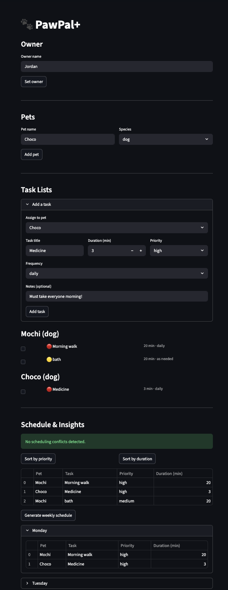

# PawPal+ (Module 2 Project)

You are building **PawPal+**, a Streamlit app that helps a pet owner plan care tasks for their pet.

## Scenario

A busy pet owner needs help staying consistent with pet care. They want an assistant that can:

- Track pet care tasks (walks, feeding, meds, enrichment, grooming, etc.)
- Consider constraints (time available, priority, owner preferences)
- Produce a daily plan and explain why it chose that plan

Your job is to design the system first (UML), then implement the logic in Python, then connect it to the Streamlit UI.

## What you will build

Your final app should:

- Let a user enter basic owner + pet info
- Let a user add/edit tasks (duration + priority at minimum)
- Generate a daily schedule/plan based on constraints and priorities
- Display the plan clearly (and ideally explain the reasoning)
- Include tests for the most important scheduling behaviors

## Getting started

### Setup

```bash
python -m venv .venv
source .venv/bin/activate  # Windows: .venv\Scripts\activate
pip install -r requirements.txt
```

## Demo



## Features

- **Priority sorting** — tasks are ranked high → medium → low using a fixed weight map, so the most critical care always surfaces first.
- **Sort by duration** — tasks can be reordered shortest → longest, helping owners fit care into tight time windows.
- **Task filtering** — retrieve any subset of tasks by pet name, completion status, or both combined.
- **Daily recurrence** — marking a daily task complete automatically appends a fresh pending copy, so the task list stays current without manual re-entry.
- **Weekly recurrence** — same as daily recurrence, but the new copy is intended for the following week.
- **Conflict warnings** — the scheduler compares every pair of timed tasks using interval overlap math (`start < other_end and other_start < end`) and returns a plain-text warning for each conflict instead of crashing.
- **Weekly schedule view** — daily tasks are placed on all 7 days, weekly tasks land on Monday, and "as needed" tasks are excluded from the auto-schedule entirely.
- **Multi-pet support** — one owner can have any number of pets, each with its own independent task list.
- **Completion toggle** — tasks can be marked done or undone via checkbox in the UI or programmatically with `mark_task_complete(id, completed=False)`.

## Smarter Scheduling

The `Scheduler` class goes beyond a basic task list with several additional features:

- **Priority sorting** — tasks are ordered high → low so the most important care happens first.
- **Sort by duration** — tasks can be sorted shortest → longest to help fit care into tight windows.
- **Filter by pet or status** — retrieve tasks for a specific pet, only pending tasks, or only completed ones.
- **Conflict detection** — if two tasks have overlapping time windows, the scheduler returns a plain-text warning instead of crashing.
- **Automatic recurrence** — daily and weekly tasks automatically generate a new pending copy when marked complete, so the list stays up to date without manual re-entry.
- **Weekly schedule view** — daily tasks are distributed across all 7 days; weekly tasks land on Monday; "as needed" tasks are excluded from the auto-schedule.

## Testing PawPal+

### Run the tests

```bash
python -m venv .venv
source .venv/bin/activate  # Windows: .venv\Scripts\activate
pip install pytest
python -m pytest tests/test_pawpal.py -v
```

### What the tests cover

The suite contains 23 tests across four categories:

- **Sorting correctness** — verifies tasks are returned in high → medium → low priority order, that completed tasks are excluded, and that empty pets return empty results without errors.
- **Recurrence logic** — confirms that daily and weekly tasks generate a new pending copy after being marked complete, that "as needed" tasks do not recur, that the new task inherits all original fields, and that it receives a fresh unique ID.
- **Conflict detection** — checks that overlapping time windows are flagged for tasks on the same pet and across different pets, that back-to-back tasks are not flagged, and that tasks without a start time or completed tasks are safely ignored.
- **Multi-pet / owner** — validates filtering by pet name, handling of owners with no pets, and graceful behavior on edge inputs.

### Confidence level

★★★★☆ (4/5)

Core scheduling logic — sorting, recurrence, and conflict detection — is well covered. The main gap is the Streamlit UI layer (`app.py`), which has no automated tests. UI behavior such as checkbox state, session persistence across reruns, and the weekly schedule display are only verifiable by running the app manually.

### Suggested workflow

1. Read the scenario carefully and identify requirements and edge cases.
2. Draft a UML diagram (classes, attributes, methods, relationships).
3. Convert UML into Python class stubs (no logic yet).
4. Implement scheduling logic in small increments.
5. Add tests to verify key behaviors.
6. Connect your logic to the Streamlit UI in `app.py`.
7. Refine UML so it matches what you actually built.
